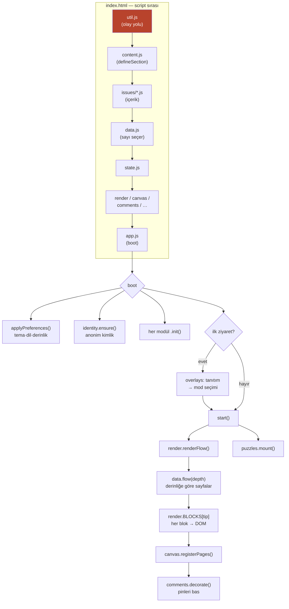
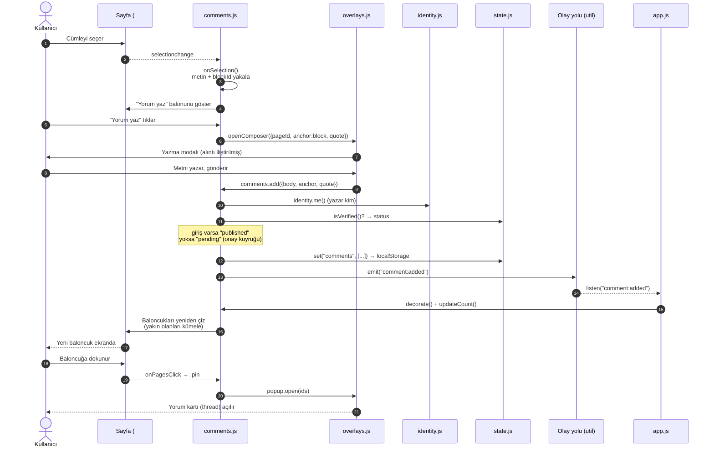

# Mimari Harita — Prototip

Bu belge `prototype/` altındaki çalışan prototipin mimarisini anlatır. Nihai
ürünün planı için [PROJE.md](PROJE.md), yorum sisteminin gerekçeleri için
[YORUM-SISTEMI.md](YORUM-SISTEMI.md), makine-okur özeti için kökteki
[AI_GUIDE.md](../AI_GUIDE.md).

> GitHub ve çoğu Markdown okuyucu aşağıdaki Mermaid diyagramlarını doğrudan
> çizer.

---

## 1. Büyük resim

`sErgi` aylık bir **sosyal web dergisi**. Depo iki katmanlı:

| Katman | Konum | Ne |
|---|---|---|
| **Plan / gerçek ürün** | `docs/PROJE.md` | Nihai hedef: **SvelteKit + Supabase**. Henüz kod yok, tasarım dokümanı. |
| **Prototip (çalışan kısım)** | `prototype/` | Derlemesiz **saf HTML/CSS/JS**. `file://` ile bile açılabilsin diye ES modül yok. Sahte veriyle gerçek deneyimi kanıtlıyor. |

Kod içi marka adı `MAG` (magazine) — tek global ad alanı.

---

## 2. Klasör yapısı

```
sErgi/
├── AI_GUIDE.md              ← Makine-okur harita: hangi fonksiyon nerede
├── .gitignore               ← Ham görsel kaynakları depoya girmez
├── .github/workflows/       ← deploy.yml: prototype/ → GitHub Pages
├── docs/                    ← Tasarım kararları (kod değil, "neden")
│   ├── PROJE.md             ← Ana mimari plan, 10 bölüm
│   ├── PROTOTIP-TODO.md     ← Canlı ilerleme listesi
│   ├── YORUM-SISTEMI.md     ← Yorum ankraj mantığının gerekçesi
│   └── MIMARI.md            ← Bu dosya
├── tools/devserver.py       ← Basit yerel sunucu
└── prototype/
    ├── index.html           ← Okuyucu. Tüm DOM iskeleti + script sırası
    ├── dev.html             ← Yazım Kiti (dev): blok kataloğu + canlı editör
    ├── css/                 ← katman katman (+ dev.css, yalnız dev.html)
    ├── assets/
    │   ├── animeace2_reg.ttf     ← Projenin tek gömülü fontu (manga balonu)
    │   ├── 2026-09/              ← 8 sayfa fotoğrafı + kapali-kapilar/ (one-shot, 9 kare)
    │   └── 2026-10/              ← Boş: bu sayının tamamı çizilmiş SVG sahne
    └── js/
        ├── content.js       ← Bölünmüş sayıları toplar (defineIssue/defineSection)
        ├── issues/          ← İÇERİK — iki biçim bir arada:
        │   ├── 2026-09.js            ← tek dosya (eski biçim)
        │   ├── 2026-09.comments.js   ← o sayıya özel tohum yorumlar
        │   ├── 2026-10/              ← bölünmüş: issue.js + sections/NN-*.js
        │   └── 2026-10.comments.js
        ├── dev/             ← Yazım Kiti betikleri (samples/catalog/editor/boot)
        └── *.js             ← ÇEKİRDEK MOTOR (içerikten bağımsız)
```

Görsel iki yoldan gelebiliyor: `js/art.js`'teki çizilmiş sahneler (`scene:` öneki)
ya da `assets/` altındaki gerçek dosyalar (`img:` öneki). 2026-10 tamamen birinciyi,
2026-09 ikisini karışık kullanıyor.

Yeni sayı hazırlama akışı (Yazım Kiti, `dev.html`) için: [prototype/README.md](../prototype/README.md#yeni-sayı-hazırlama--yazım-kiti-devhtml).

**CSS katmanları (yükleme sırası anlamlı):**
`tokens` (değişkenler/tema) → `base` (iskelet) → `canvas` (3:4 tuval) →
`blocks` (içerik blokları + animasyon) → `comments` → `overlays` (paneller/modal)
→ `puzzles` → `analytics`. Tema tamamen `tokens.css`'teki CSS değişkenleriyle;
sayı değişince renkler değişir.

---

## 3. Modüller nasıl haberleşir? — üç mekanizma

Her JS dosyası `(function (MAG) { … MAG.x = … })(window.MAG)` kalıbıyla kendini
`MAG` altına asar.

1. **`MAG` ad alanı (doğrudan çağrı):** `MAG.canvas.goToId(...)`,
   `MAG.comments.add(...)`. Senkron işler.
2. **Olay veri yolu (gevşek bağ):** `util.js`'te gizli bir DOM düğümü.
   `U.emit("comment:added", …)` yayar, ilgilenen modüller `U.listen(...)` ile
   dinler. Modüller birbirini tanımadan konuşur.
3. **`state.js` + localStorage:** Tek doğruluk kaynağı. `State.set` yapınca hem
   kaydeder hem `state:change` yayar. `storage` olayıyla sekmeler arası
   eşitleme de var.

**Kritik yükleme sırası** (`index.html`):
`util → art → content → issues/*.js → data → *.comments.js → data-comments →
data-analytics → state → render → canvas → … → app`.

İki kural sırayı bağlıyor:

1. **İçerik `data.js`'ten önce.** Sayı dosyaları kendini `MAG.issues`'a kaydeder,
   `data.js` okuma anında bu defterin bir kopyasını alır (`var REG = MAG.issues`) —
   sonra gelen bir sayı görünmez olur. Sıra bozulursa `data.js` sessizce değil,
   açıkça `throw` eder.
2. **`content.js` bölüm dosyalarından önce.** `defineIssue`/`defineSection`'ı o
   tanımlıyor; bölünmüş biçimdeki her bölüm dosyası açılır açılmaz onu çağırıyor.

---

## 4. Mimari & açılış akışı



---

## 5. Veri akışı: kullanıcı bir cümle seçip yorum yazınca



**Akışın özü:** (1) *yakalama* `comments.js`'te — seçim → hangi bloğa ait
(`data-block-id`, `render.js`'in bastığı kimlik). (2) *kalıcılık* `state.js`
üzerinden localStorage'a; kimlik `identity.js`, onay durumu `isVerified()`.
(3) *yansıma* doğrudan değil, **`comment:added` olayı** üzerinden — `app.js`
dinler, `comments.decorate()`'i çağırır, pin ekrana düşer.

---

## 6. Öğrenme sırası önerisi

`util.js` (olay yolu) → `state.js` → `data.js` → `render.js` → `canvas.js` →
`comments.js`. Bu beşi çekirdeğin tamamı.
